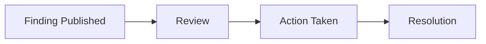

---
title: "Responding to Findings"
description: "How to review, acknowledge, and take action on findings discovered during your audit."
---

<Note>
The remediation experience is currently being redesigned to make it faster and clearer to act on findings. This page documents the current flow, which remains fully functional in the meantime — we'll update this guide as the new experience rolls out.
</Note>

## How findings appear

As an audit progresses, new findings are published to your dashboard as soon as they're validated — you don't need to wait until the audit is fully complete to start seeing results. Each new finding shows up in your **Findings Dashboard**, along with:

- A short title describing the issue
- Its severity level
- The affected asset (the system, application, or endpoint where it was found)
- The date it was discovered

Both Organisation Admins and Organisation Members can view new findings as they appear.

## Understanding a Finding

Each finding includes a few key pieces of information to help you understand how serious it is and what to do about it.

**Severity level** — every finding is rated as one of the following:

| Severity | What it means |
|----------|----------------|
| **Critical** | An urgent issue that could be actively exploited right now. Needs immediate attention. |
| **High** | A serious issue that should be addressed soon, though it may not be immediately exploitable. |
| **Medium** | A moderate risk that should be planned into your remediation work. |
| **Low** | A minor issue with limited impact, worth fixing but not urgent. |
| **Info** | Not a vulnerability itself, but useful context or a best-practice recommendation. |

**CVSS score** — alongside the severity level, findings often include a CVSS (Common Vulnerability Scoring System) score, a number from 0 to 10 that gives a standardized, more granular sense of how serious the issue is. A higher number means a more serious issue.

**Recommendation** — every finding includes a plain-English explanation of what the issue is and specific guidance on how to fix it, so you don't need security expertise to know what to do next.

## Taking action

For each finding, you can take one of the following actions:

- **Acknowledge** — confirms you've seen the finding and are aware of it. This doesn't mean it's fixed, just that it's on your radar.
- **Mark as resolved** — use this once you've applied the fix. This moves the finding out of your active list, though it may be verified in a future scan or re-test.
- **Request clarification** — if a finding is unclear or you're not sure how it applies to your systems, you can request clarification directly, and the audit team will follow up with more detail.

## Expected remediation flow

| Stage | What happens |
|-------|----------------|
| **Finding** | A new finding is published to your dashboard. |
| **Review** | You review the finding's severity, CVSS score, and recommendation to understand the issue. |
| **Action** | You acknowledge the finding, mark it resolved, or request clarification. |
| **Resolution** | The finding is closed out, either confirmed fixed or verified in a later scan. |

## FAQ

<AccordionGroup>
  <Accordion title="Do I need to fix every finding, even Low or Info ones?">
    Not necessarily — Low and Info findings are usually lower priority, but reviewing them still helps you build a fuller picture of your security posture over time.
  </Accordion>
  <Accordion title="What happens after I mark a finding as resolved?">
    It's removed from your active findings list. Depending on your audit type, it may be verified again in a follow-up scan or re-test to confirm the fix worked.
  </Accordion>
  <Accordion title="Can I undo an action if I marked something by mistake?">
    Yes — reach out to support if you need to revert an action on a finding, and the team can help correct it.
  </Accordion>
  <Accordion title="Will the remediation flow change with the upcoming redesign?">
    The core concepts (review, act, resolve) will stay the same, but the interface and some of the steps may be simplified. This page will be updated once the new experience is available.
  </Accordion>
  <Accordion title="Who can take action on findings — Admins or Members too?">
    Both Organisation Admins and Organisation Members can acknowledge, resolve, or request clarification on findings.
  </Accordion>
</AccordionGroup>