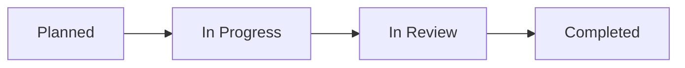

---
title: "Understanding Your Audit Results"
description: "What an audit is, how to track its progress, and what you receive once it's complete."
---

## What is an Audit?

An audit is a structured security assessment of your organisation's systems, carried out to find weaknesses before they can be used against you. Instead of guessing whether your defenses are solid, an audit gives you a clear, evidence-based picture of where you stand.

During an audit, a security team examines your systems using a mix of automated scanning and hands-on testing, depending on the type of audit requested. They look for things like outdated software, misconfigured settings, exposed systems, and other weaknesses that could be exploited. Everything they find is documented, rated by how serious it is, and delivered back to you in a clear, actionable format.

You don't need any security background to understand your results — Rifteo is built to translate technical findings into plain language, so both Organisation Admins and Organisation Members can act on them.

## Audit Status Tracking

Every audit moves through a set of stages. You can check the current stage at any time from your dashboard.

| Status | What it means |
|--------|----------------|
| **Planned** | The audit has been scheduled and scoped, but testing hasn't started yet. |
| **In Progress** | Testing is actively underway. New findings may appear on your dashboard as they're discovered. |
| **In Review** | Testing is complete. The team is validating findings, removing false positives, and preparing your final report. |
| **Completed** | The audit is finished. Your full report, findings, and any discovered assets are available in your dashboard. |

## What you receive

Once an audit reaches **Completed**, you'll have access to:

- **Findings** — a list of every issue discovered, each with a severity rating (Critical, High, Medium, Low, or Info) and a plain-English explanation of what it means and how to fix it.
- **Reports** — a consolidated document summarizing the audit, suitable for sharing with stakeholders or keeping for compliance records.
- **Discovered assets** — an updated view of your asset inventory, including any systems or subdomains the team found that you may not have known were exposed.

## Audit Categories

Rifteo supports a few different types of audits, depending on what you need assessed.

| Category | What it covers | Best for |
|----------|-----------------|----------|
| **Pentest** | A hands-on, simulated attack against a specific system or application, carried out by security professionals to find exploitable weaknesses. | Testing a specific app, product, or system in depth before a launch or compliance deadline. |
| **Vulnerability Assessment** | An automated scan that identifies known vulnerabilities across your systems, without actively trying to exploit them. | Getting a broad, regular check of your security posture without a full hands-on test. |
| **Attack Surface** | Ongoing discovery and monitoring of all your externally exposed assets — websites, servers, subdomains — to track what's visible to potential attackers over time. | Maintaining continuous visibility into what's exposed, rather than a one-time snapshot. |

## FAQ

<AccordionGroup>
  <Accordion title="How long does an audit take?">
    It depends on the audit category and scope. A Vulnerability Assessment is typically the fastest, while a Pentest can take longer due to the hands-on testing involved. Your specific timeline is shared with you when the audit is scheduled.
  </Accordion>
  <Accordion title="Will I be notified when my audit status changes?">
    Yes. Both Organisation Admins and Organisation Members with dashboard access can see status updates in real time, and notifications can be configured in your account settings.
  </Accordion>
  <Accordion title="What happens if a Critical finding is discovered mid-audit?">
    Critical findings are typically flagged as soon as they're validated, even before the audit reaches Completed, so you can act on urgent issues without waiting for the final report.
  </Accordion>
  <Accordion title="Can I request a re-test after fixing findings?">
    Yes, re-testing is available to confirm that a finding has been properly resolved. Reach out to support to arrange this.
  </Accordion>
  <Accordion title="Who can view audit results — Admins or Members too?">
    Both roles can view audit results, findings, and reports. Only Organisation Admins can manage the account-level settings around scheduling and team access.
  </Accordion>
</AccordionGroup>